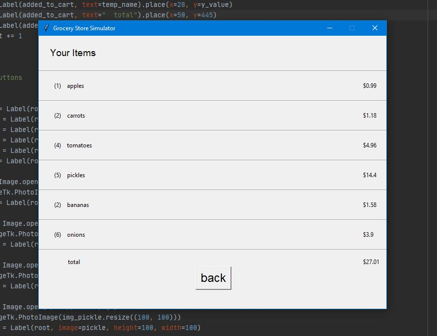

# Grocery-Store-Simulator
A GUI of a simple store that sells fruits and vegetables with a cart and checkout system, using the Python tkinter tool kit.

### (Day 1)
- created the basic design and layout for the shopping page
- added widgets for interactivity

### (Day 2)
- created the basic design and layout for the checkout page
- added a system that lists the quantity of every item in your cart
- added a system that calculates the total cost

